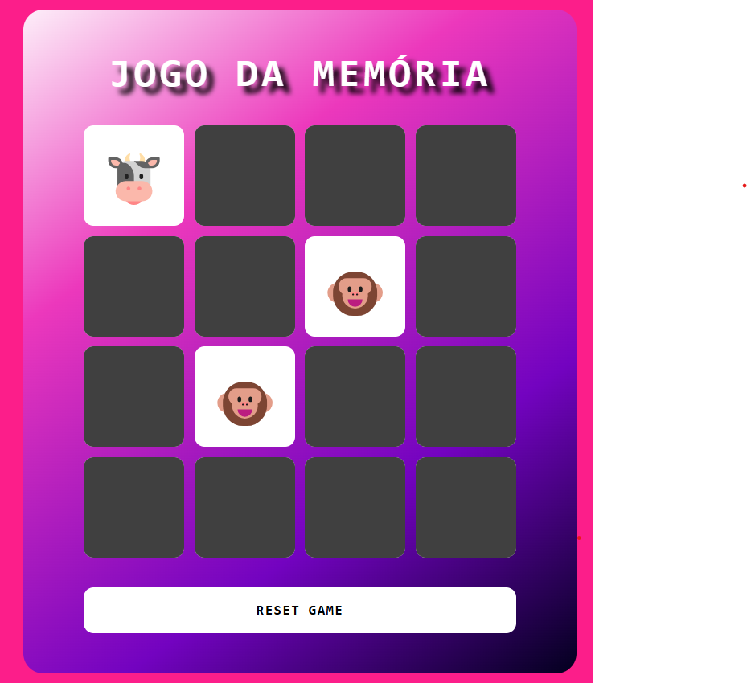

Jogo da memória criado após participação no Bootcamp Ri Happy - Front-end do Zero na [Dio](https://web.dio.me/home)

Competências adquiridas ao longo do desenvolvimento:

- Manipulação de Document Object Model (DOM): Praticamente todos os elementos foram gerados via JavaScript.
- Estilização em CSS.
- Técnica para trabalhar com cores gradientes.

 

