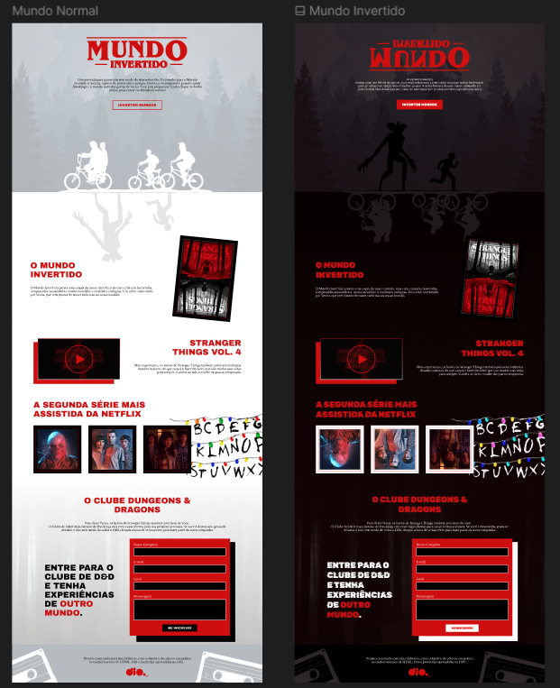

    

-------
Uma jornada para quem não tem medo do desconhecido. O caminho para o Mundo Invertido é incerto, repleto de obstáculos e perigos. Porém, a recompensa é grande: salvar Hawkings e o mundo todo das garras de Vecna. Você está preparado(a)? 

## 💻 Tecnologias
- HTML
- CSS
- JavaScript

## 💬 Competências trabalhadas ao longo do desenvolvimento
- HTML
    - Estruturação da página 
    - Semântica
    - Acessibilidade
    - Web Scraping
    - SEO
- CSS
    - Posicionamentos
    - Pseudo-elementos
    - Pseudo-classes
    - Flexbox
    - Animações 
- JavaScript
    - Introdução ao JavaScript
    - Manipulação do DOM
    - Introdução ao Firebase
    - Integração com o Firebase

## 🎨 Imagem da página desenvolvida

## 🔗 Links auxiliares

- [W3C - World Wide Web Consortium](http://w3c.org)
- [WAI - Web Acessibility Initiative](https://www.w3.org/WAI/)
- [WCAG 2](https://www.w3.org/WAI/WCAG21/quickref/) 
- [Figma](https://www.figma.com/file/I3Q42CcVUziRN3iMfTrbfb/Stranger-Things?node-id=0%3A1) 
- [Demo](https://micheleambrosio.github.io/semana-frontend-mundo-invertido/) 

## 🕹️ Como Utilizar
1. Clone este repositório para sua máquina local.
2. Abra o arquivo index.html em seu navegador web.
3. Clique no botão "Inverter Mundos" para anternar entre os temas Claro e Escuro.
4. Divirta-se!
   
## 📝 Considerações Finais

    Página criada após participação no Bootcamp Ri Happy - Front-end do Zero na [Dio](https://web.dio.me/home)
  

