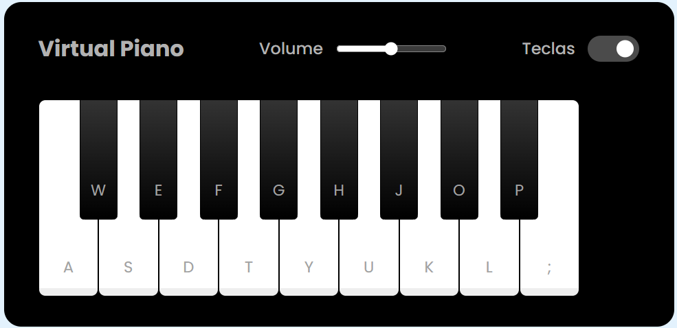

# Piano Virtual criado após participação no Bootcamp Ri Happy - Front-end do Zero na [Dio](https://web.dio.me/home)

## Competências trabalhadas ao longo do desenvolvimento:

- Estilização em CSS.
- Manipulação da D.O.M. do Browser através de Javascript .
- Importação de fontes externas.
- Técnica para trabalhar com cores gradientes.
- Utilização de Pseudo Elementos.
- Trabalhando com os posicionamentos absolute e relative.
- Utilização do recurso Dataset.
- Utilização da técnica de interpolação de strings.
- Trabalhando com eventos de keydown.
- Interação com áudios.
- Tratamento de erros.

## Como Utilizar
1. Clone este repositório para sua máquina local.
2. Abra o arquivo index.html em seu navegador web.
3. Clique nas teclas ou pressione as teclas correspondentes no teclado do computador para formar a melodia.
4. Divirta-se!

 

